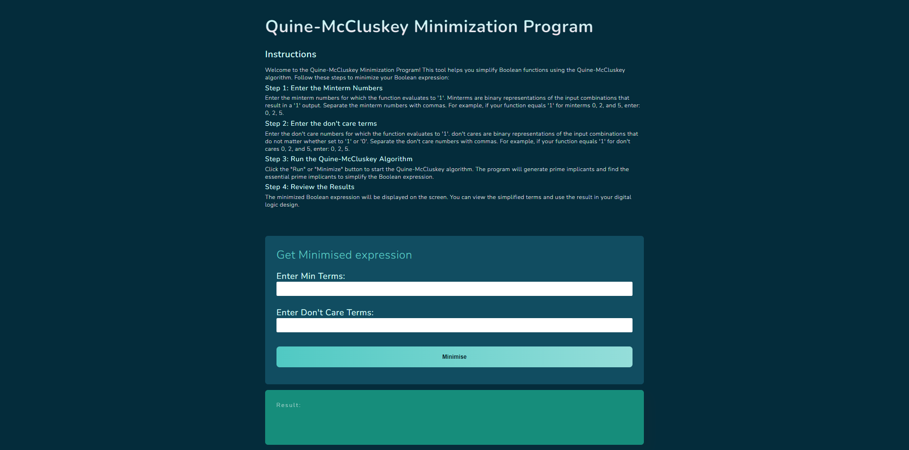
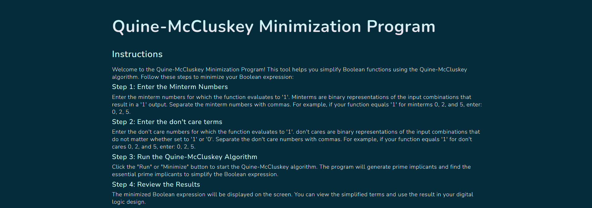

  
  <h3>
    <b>
      Quine McCluskey
    </b>
  </h3>
  <b>
    Multi Variable Boolean function minimization Algorithm
  </b>
  

  

  

  

    
      Built with ❤︎ by
      <a href="https://github.com/rahulc0dy/QuineMcCluskey/graphs/contributors">
        contributors
      </a>
    
  

   
  

    <a href="https://rahulc0dy.github.io/QuineMcCluskey">
      <picture>
        <!-- <source media="(prefers-color-scheme: dark)" srcset="./packages/hoppscotch-common/public/images/banner-dark.png">
        <source media="(prefers-color-scheme: light)" srcset="./packages/hoppscotch-common/public/images/banner-light.png"> -->
        
      </picture>
    </a>
  

## 📄 Instructions

Welcome to the Quine-McCluskey Minimization Program! This tool helps you simplify Boolean functions using the Quine-McCluskey algorithm. Follow these steps to minimize your Boolean expression:

-   #### Step 1: Enter the Minterm Numbers

    Enter the minterm numbers for which the function evaluates to '1'. Minterms are binary representations of the input combinations that result in a '1' output. Separate the minterm numbers with commas. For example, if your function equals '1' for minterms 0, 2, and 5, enter: 0, 2, 5.

-   #### Step 2: Enter the don't care terms

    Enter the don't care numbers for which the function evaluates to '1'. don't cares are binary representations of the input combinations that do not matter whether set to '1' or '0'. Separate the don't care numbers with commas. For example, if your function equals '1' for don't cares 0, 2, and 5, enter: 0, 2, 5.

-   #### Step 3: Run the Quine-McCluskey Algorithm

    Click the "Run" or "Minimize" button to start the Quine-McCluskey algorithm. The program will generate prime implicants and find the essential prime implicants to simplify the Boolean expression.

-   #### Step 4: Review the Results
    The minimized Boolean expression will be displayed on the screen. You can view the simplified terms and use the result in your digital logic design.

## 🥷 Authors

-   [Rahul Chakraborty](https://www.github.com/rahulc0dy)

## 🪟 Code Overview

Let's go through the main functions and the overall flow of the code:

#### diffByOneBit(term1, term2):

-   This function checks if two binary terms differ by only one bit.
-   It returns an array with two elements:

    -   The first element is a boolean indicating whether the terms differ by only one bit.
    -   The second element is the index of the differing bit.

#### listConvert(dictionary):

-   This function converts a dictionary of minterms into a list of minterms.

#### findMinterms(implicant):

-   This function generates all minterms covered by a given implicant.

#### removeDontCares(minTerms, dontCares):

-   This function removes the don't care terms from the list of minterms.

#### essentialPrimeImplicants(table):

-   This function identifies essential prime implicants from the prime implicant chart.

#### removeTerms(table, terms):

-   This function removes terms from the prime implicant chart.

#### coveringPrimeImplicants(table):

-   This function identifies covering prime implicants from the prime implicant chart.

#### isSubset(arr1, arr2):

-   This function checks if arr1 is a subset of arr2.

#### arraysEqual(arr1, arr2):

-   This function checks if two arrays are equal.

#### makeExpression(epi):

-   This function creates a boolean expression from a list of essential prime implicants.

#### quineMcclusky(minterms, dontCare):

-   This is the main function that performs the Quine-McCluskey algorithm.
-   It starts by creating groups of minterms based on the number of 1s in their binary representation.
-   It iteratively combines adjacent groups to generate new groups until no more combinations are possible.
-   The prime implicants are then extracted from the final groups.
-   The prime implicant chart is created, and essential prime implicants are identified.
-   If there are no essential prime implicants, covering prime implicants are used.
-   The final boolean expression is created using the selected prime implicants.

## 🔘 Color Reference

| Color         | Theme usage     | Hex                                                              |
| ------------- | --------------- | ---------------------------------------------------------------- |
| Example Color | light-secondary |  #64ccc5 |
| Example Color | light-primary   |  #dafffb |
| Example Color | dark-secondary  |  #114d61 |
| Example Color | dark-primary    |  #042c3b |

## 🕸️ Deployment

For the github page for this project [click here.](https://rahulc0dy.github.io/QuineMcCluskey)

To deploy this project locally : -

    1. Clone this Project to your system
    2. Run the index.html file in your browser

## 📷 Screenshots

## 🔗 Links

## 🛠 Skills

-   HTML5
-   CSS3
-   JavaScript
